## ¿Cómo demostramos qué recursos pueden comunicarse, por qué camino y con qué nivel de exposición?

**Respuesta:**

> Lo demostramos combinando direccionamiento, tablas de rutas, Internet Gateway, Security Groups y Network ACLs, y verificando el comportamiento mediante SSH y ping. La EC2 pública tiene IPv4 pública, pertenece a una subnet cuya tabla de rutas contiene `0.0.0.0/0 → IGW` y su Security Group permite SSH desde la IP del equipo. La EC2 privada no tiene IPv4 pública ni ruta por defecto hacia el IGW, pero puede recibir ICMP desde la EC2 pública mediante su Security Group. 

---

# LAB 1 — Infraestructura base

La arquitectura será:

```text
                         INTERNET
                            │
                            │
                       ┌────▼────┐
                       │   IGW   │
                       └────┬────┘
                            │
                 ┌──────────┴─────────────────┐
                 │                            │
          Public RT                       Private RT
        0.0.0.0/0 → IGW                   SOLO local
                 │                            │
        ┌────────┴───────┐             ┌──────┴────────┐
        │                │             │               │
   Public A          Public B       Private A     Private B
 10.20.10.0/24      10.20.20.0/24      │
 us-east-1a         us-east-1b         │
        │                              │
        │                              │
   EC2 pública ──── ICMP ───────►    EC2 privada
   IPv4 pública                     SIN IPv4 pública
```

El plan de direccionamiento indicado por el laboratorio es: 
- VPC `10.20.0.0/16`, 
   - Públicas `10.20.10.0/24` y `10.20.20.0/24`
   - Privadas `10.20.110.0/24` y `10.20.120.0/24`

Distribuidas entre `us-east-1a` y `us-east-1b`. 

---

# FASE 0 — Red

| Recurso   | CIDR             | AZ           | Propósito                     |
| --------- | ---------------- | ------------ | ----------------------------- |
| VPC       | `10.20.0.0/16`   | Regional     | Red de Digital Café Luna      |
| Public A  | `10.20.10.0/24`  | `us-east-1a` | EC2 pública temporal          |
| Public B  | `10.20.20.0/24`  | `us-east-1b` | Capacidad pública/redundancia |
| Private A | `10.20.110.0/24` | `us-east-1a` | Recursos internos             |
| Private B | `10.20.120.0/24` | `us-east-1b` | Recursos internos             |

### Respuesta para el diseño

**¿Por qué dividir en públicas y privadas?**

> La segmentación permite separar recursos expuestos de recursos internos. La subnet pública tiene una ruta hacia el Internet Gateway y puede alojar una EC2 con IPv4 pública, mientras que las subnets privadas no tienen una ruta por defecto hacia Internet. La exposición no depende únicamente del nombre de la subnet, sino de direccionamiento, rutas y controles de tráfico. 

---

# FASE 1 — Crear la VPC

En la consola:

**AWS Console → VPC → Your VPCs → Create VPC**

Selecciona:

**VPC only**

Nombre:

```text
dcl-lab1-vpc
```

IPv4 CIDR:

```text
10.20.0.0/16
```

No IPv6.

No necesitas crear NAT Gateway.

Crea la VPC.

Comando para consultar las vpc:
```bash
aws ec2 describe-vpcs \
  --region us-east-1 \
  --filters "Name=tag:Name,Values=dcl-lab1-vpc" \
  --query 'Vpcs[].{ID:VpcId,CIDR:CidrBlock,Default:IsDefault,State:State,Name:Tags[?Key==`Name`]|[0].Value}' \
  --output table
```

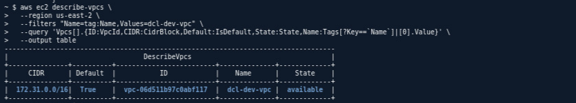


---

# FASE 1.1 — Crear las cuatro subnets

Ve a:

**VPC → Subnets → Create subnet**

Selecciona:

```text
dcl-lab1-vpc
```

## Public A

```text
Name: dcl-lab1-subnet-public-a
AZ: us-east-1a
IPv4 CIDR: 10.20.10.0/24
```

## Private A

```text
Name: dcl-lab1-subnet-private-a
AZ: us-east-1a
IPv4 CIDR: 10.20.110.0/24
```

## Public B

```text
Name: dcl-lab1-subnet-public-b
AZ: us-east-1b
IPv4 CIDR: 10.20.20.0/24
```

## Private B

```text
Name: dcl-lab1-subnet-private-b
AZ: us-east-1b
IPv4 CIDR: 10.20.120.0/24
```
Comando para consultar las subnets:
```bash
aws ec2 describe-subnets \
  --region us-east-1 \
  --filters "Name=vpc-id,Values=vpc-0cba829cb5c7746b2" \
  --query 'Subnets[].{Name:Tags[?Key==`Name`]|[0].Value,CIDR:CidrBlock,AZ:AvailabilityZone,ID:SubnetId,PublicIP:MapPublicIpOnLaunch}' \
  --output table
```

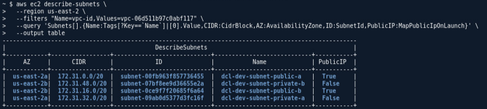


---

# FASE 1.2 — Activar IPv4 pública

Para **Public A**:

**Subnet → Actions → Edit subnet settings**

Activa:

```text
Enable auto-assign public IPv4 address
```

Haz lo mismo para **Public B**.

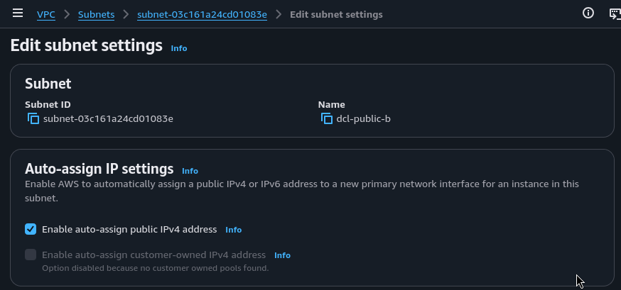

No es necesario habilitarlo en las privadas.

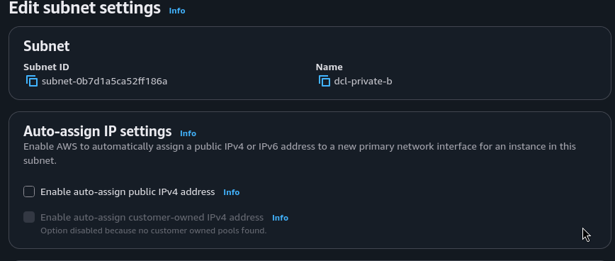

El laboratorio específicamente pide auto-assign público únicamente en las subnets públicas si utilizas esta estrategia. 

---

# FASE 2 — Internet Gateway y Route Tables

## 2.1 Crear IGW

Ve a:

**VPC → Internet Gateways → Create internet gateway**

Nombre:

```text
dcl-lab1-igw
```

Crear.

Luego:

**Actions → Attach to VPC**

Selecciona:

```text
dcl-lab1-vpc
```

Comando para consultar el internet gateway:
```bash
aws ec2 describe-internet-gateways \
  --region us-east-1 \
  --filters "Name=attachment.vpc-id,Values=vpc-0cba829cb5c7746b2" \
  --query 'InternetGateways[].{ID:InternetGatewayId,State:Attachments[0].State,VPC:Attachments[0].VpcId}' \
  --output table

```

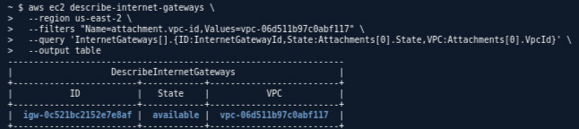

---

# 2.2 Crear Route Table pública

Ve a:

**VPC → Route Tables → Create route table**

Nombre:

```text
dcl-lab1-rt-public
```

VPC:

```text
dcl-lab1-vpc
```

Crear.

Después entra a la tabla:

**Routes → Edit routes → Add route**

Pon:

```text
Destination: 0.0.0.0/0
Target: Internet Gateway
dcl-lab1-igw
```

Guarda.

---

# 2.3 Asociar las dos públicas

En la misma route table:

**Subnet associations → Edit subnet associations**

Selecciona:

```text
☑ dcl-lab1-subnet-public-a
☑ dcl-lab1-subnet-public-b
```

Guarda.


Comando para consultar la tabla de ruta publica:
```bash
aws ec2 describe-route-tables \
  --region us-east-1 \
  --filters "Name=vpc-id,Values=vpc-0cba829cb5c7746b2" "Name=tag:Name,Values=dcl-rt-public" \
  --query 'RouteTables[].{RouteTableId:RouteTableId, Routes:Routes[?GatewayId!=null].{DestinationCidrBlock:DestinationCidrBlock, GatewayId:GatewayId}, AssociatedSubnets:Associations[].SubnetId}' \
  --output json
```

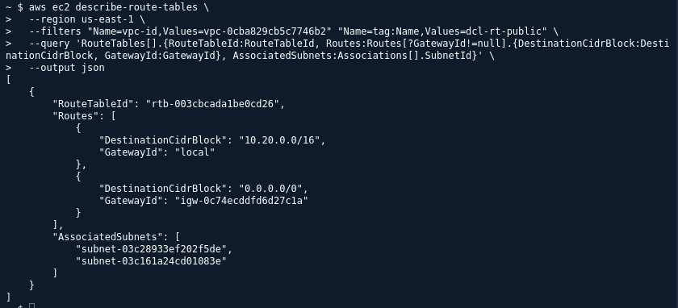


---

# 2.4 Crear Route Table privada

Otra vez:

**Route Tables → Create route table**

Nombre:

```text
dcl-lab1-rt-private
```

VPC:

```text
dcl-lab1-vpc
```

Aquí **NO agregues**:

```text
0.0.0.0/0 → IGW
```

Debe quedarse solamente la ruta local de la VPC.

Asocia:

```text
☑ dcl-lab1-subnet-private-a
☑ dcl-lab1-subnet-private-b
```

El documento exige exactamente que las públicas tengan `0.0.0.0/0 → IGW` y que las privadas no tengan ruta por defecto al IGW. 


Comando para consultar la tabla de ruta privada:
```bash
aws ec2 describe-route-tables \
  --region us-east-1 \
  --filters "Name=vpc-id,Values=vpc-0cba829cb5c7746b2" "Name=tag:Name,Values=dcl-rt-private" \
  --query 'RouteTables[].{RouteTableId:RouteTableId, Routes:Routes[?GatewayId!=null].{DestinationCidrBlock:DestinationCidrBlock, GatewayId:GatewayId}, AssociatedSubnets:Associations[].SubnetId}' \
  --output json
```

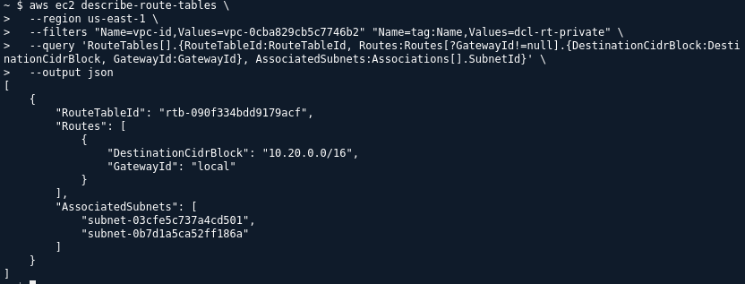

---

# FASE 3 — Security Groups

Ahora vamos a crear los controles.

## 3.1 SG público

Ve a:

**VPC → Security Groups → Create security group**

Nombre:

```text
dcl-lab1-sg-public
```

Descripción:

```text
Control de acceso para EC2 pública del LAB 1
```

VPC:

```text
dcl-lab1-vpc
```

### Inbound

Agrega:

```text
Type: SSH
Protocol: TCP
Port: 22
Source: My IP
```

AWS debería colocar algo parecido a:

```text
X.X.X.X/32
```

**No uses `0.0.0.0/0`.**

El PDF exige SSH únicamente desde la IPv4 pública actual del equipo. 

Para averiguar tu IP desde Kali puedes usar:

```bash id="c81nmx"
curl -4 ifconfig.me
```

Por ejemplo:

```text
181.xxx.xxx.xxx
```

Entonces el SG debe tener:

```text
181.xxx.xxx.xxx/32
```

Comando para consultar el grupo de seguridad publico:
```bash
aws ec2 describe-security-groups \
    --region us-east-1 \
    --filters "Name=vpc-id,Values=vpc-0cba829cb5c7746b2" "Name=group-name,Values=dcl-sg-public" \
    --query 'SecurityGroups[*].IpPermissions' \
    --output json
```

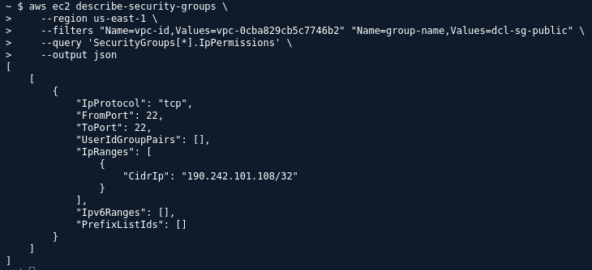


---

# 3.2 SG privado

Crear otro:

```text
dcl-lab1-sg-private
```

VPC:

```text
dcl-lab1-vpc
```

Inbound:

```text
Type: All ICMP - IPv4
Source: Custom
```

Y selecciona como origen:

```text
dcl-lab1-sg-public
```

Esto es importante: **no pongas `0.0.0.0/0`**.

Queremos:

```text
EC2 pública
   │
   │ ICMP
   ▼
EC2 privada
```

El PDF indica específicamente que el SG privado debe permitir ICMP IPv4 desde `dcl-lab1-sg-public`. 

Comando para consultar el grupo de seguridad privado:
```bash
aws ec2 describe-security-groups \
    --region us-east-1 \
    --filters "Name=vpc-id,Values=vpc-0cba829cb5c7746b2" "Name=group-name,Values=dcl-sg-private" \
    --query 'SecurityGroups[*].IpPermissions' \
    --output json
```

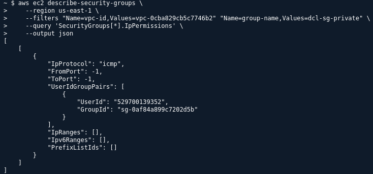


---

# FASE 3.3 — NACL privada

Ahora:

**VPC → Network ACLs → Create network ACL**

Nombre:

```text
dcl-lab1-nacl-private
```

VPC:

```text
dcl-lab1-vpc
```

---

## Asociar las dos privadas

Entra en la NACL:

**Subnet associations → Edit**

Selecciona:

```text
☑ dcl-lab1-subnet-private-a
☑ dcl-lab1-subnet-private-b
```
Comando para consultar el NACls:
```bash
aws ec2 describe-network-acls \
    --region us-east-1 \
    --filters "Name=vpc-id,Values=vpc-0cba829cb5c7746b2" "Name=tag:Name,Values=dcl-nacl-private" \
    --output json
```

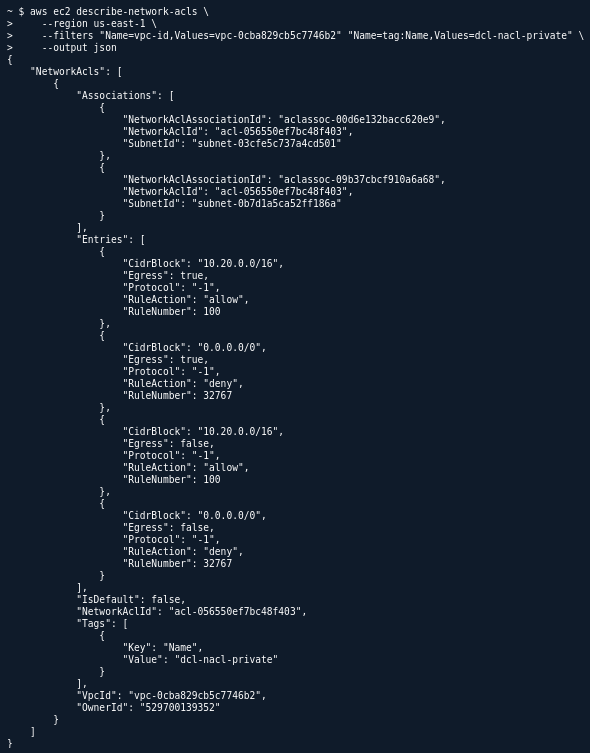


---

## Inbound rules

**Inbound rules → Edit inbound rules → Add rule**

Pon:

```text
Rule number: 100
Type: All traffic
Protocol: All
Source: 10.20.0.0/16
Allow
```

Comando para consultar las inboud rules del NACls:
```bash
aws ec2 describe-network-acls \
    --region us-east-1 \
    --filters "Name=vpc-id,Values=vpc-0cba829cb5c7746b2" "Name=tag:Name,Values=dcl-nacl-private" \
    --query 'NetworkAcls[*].Entries[?Egress == `false`]' \
    --output json
```

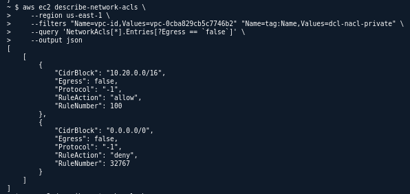


## Outbound rules

Agrega:

```text
Rule number: 100
Type: All traffic
Protocol: All
Destination: 10.20.0.0/16
Allow
```

El resto puede quedar con el **deny implícito**.

Esto corresponde al requisito del PDF: permitir tráfico IPv4 dentro del CIDR de la VPC en entrada y salida, manteniendo bloqueado implícitamente lo que venga de otros orígenes. 


Comando para consultar las outbound rules del NACls:
```bash
aws ec2 describe-network-acls \
    --region us-east-1 \
    --filters "Name=vpc-id,Values=vpc-0cba829cb5c7746b2" "Name=tag:Name,Values=dcl-nacl-private" \
    --query 'NetworkAcls[*].Entries[?Egress == `true`]' \
    --output json
```

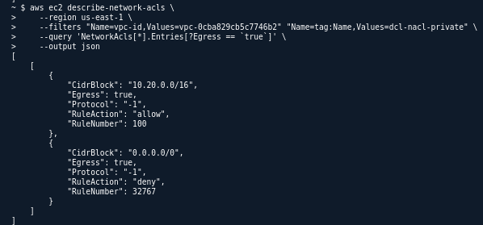

---

# FASE 4 — Crear las dos EC2

Ahora sí creamos las máquinas temporales.

No necesitas instalar Apache ni ningún software adicional. El laboratorio explícitamente dice que esta práctica evalúa red. 

---

## EC2 pública

Ve a:

**EC2 → Instances → Launch instance**

Nombre:

```text
dcl-lab1-ec2-public
```

AMI:

Puedes usar una AMI Linux pequeña disponible, por ejemplo Amazon Linux.

Tipo:

```text
t3.micro
```

o el tipo pequeño que permita tu cuenta.

### Key pair

Selecciona/crea uno temporal.

**No compartas la clave privada.**

### Network settings

VPC:

```text
dcl-lab1-vpc
```

Subnet:

```text
dcl-lab1-subnet-public-a
```

Auto-assign Public IP:

```text
Enable
```

Security Group:

```text
dcl-lab1-sg-public
```

Lanza la instancia.

Comando para consultar la public EC2:
```bash
aws ec2 describe-instances \
    --region us-east-1 \
    --filters "Name=tag:Name,Values=dcl-lab1-ec2-public" \
    --query 'Reservations[*].Instances[*].{
        Nombre: Tags[?Key==`Name`] | [0].Value,
        AMI: ImageId,
        Tipo: InstanceType,
        KeyName: KeyName,
        SubnetId: SubnetId,
        PublicIPAsignada: PublicIpAddress,
        SecurityGroups: SecurityGroups[*].GroupId
    }' \
    --output json
```

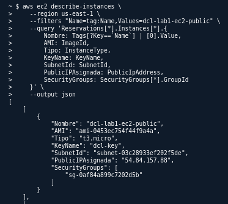

---

# EC2 privada

Otra:

Nombre:

```text
dcl-lab1-ec2-private
```

Misma AMI.

Mismo tipo.

VPC:

```text
dcl-lab1-vpc
```

Subnet:

```text
dcl-lab1-subnet-private-a
```

Auto-assign Public IP:

```text
Disable
```

Security Group:

```text
dcl-lab1-sg-private
```

Lanza.


Comando para consultar la private EC2:
```bash
aws ec2 describe-instances \
    --region us-east-1 \
    --filters "Name=tag:Name,Values=dcl-lab1-ec2-private" \
    --query 'Reservations[*].Instances[*].{
        Nombre: Tags[?Key==`Name`] | [0].Value,
        AMI: ImageId,
        Tipo: InstanceType,
        KeyName: KeyName,
        SubnetId: SubnetId,
        PublicIPAsignada: PublicIpAddress,
        SecurityGroups: SecurityGroups[*].GroupId
    }' \
    --output json
```

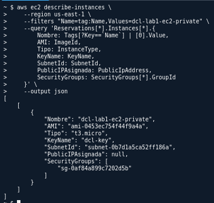


---

# FASE 4.1 — Verificación de direccionamiento

En CloudShell:

```bash id="2e4gsl"
aws ec2 describe-instances \
  --region us-east-1 \
  --filters "Name=tag:Name,Values=dcl-lab1-ec2-public,dcl-lab1-ec2-private" \
  --query 'Reservations[].Instances[].{Name:Tags[?Key==`Name`]|[0].Value,ID:InstanceId,Subnet:SubnetId,AZ:Placement.AvailabilityZone,PrivateIP:PrivateIpAddress,PublicIP:PublicIpAddress,State:State.Name}' \
  --output table
```
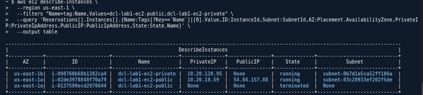

---

# 5.1 SSH a la pública

Desde tu Kali:

```bash
ssh -i TU-CLAVE.pem ec2-user@IP_PUBLICA
```

Ejemplo:

```bash
ssh -i lab1.pem ec2-user@54.xxx.xxx.xxx
```

Debe funcionar.

Esto demuestra:

```text
Internet
   ↓
IPv4 pública
   ↓
Public subnet
   ↓
IGW
   ↓
SG público permite TCP/22 desde TU_IP/32
   ↓
EC2 pública
```

El laboratorio pide demostrar acceso SSH únicamente a la EC2 pública. 

.png)
.png)

---

# 5.2 Ping pública → privada

Una vez dentro de la EC2 pública:

```bash
ping -c 4 IP_PRIVADA
```

Esto demuestra comunicación privada entre las dos EC2.

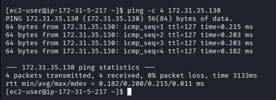

---

# FASE 6 — Permitido → Bloqueado → Restaurado

Esta es **obligatoria**.

Primero tenemos:

```text
SG privado:
ICMP ← SG público
```

y el ping funciona.


---

# 6.2 Bloquear ICMP

Ahora en AWS Console:

**VPC → Security Groups → dcl-lab1-sg-private**

Ve a:

**Inbound rules → Edit inbound rules**

Elimina:

```text
All ICMP - IPv4
Source: dcl-lab1-sg-public
```

Guarda.

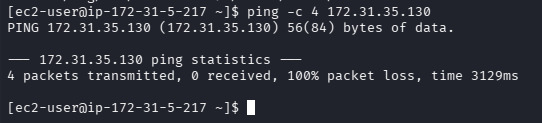

---

# 6.4 Restaurar

Regresa al SG privado.

Agrega nuevamente:

```text
Type: All ICMP - IPv4
Source: dcl-lab1-sg-public
```

Guarda.


---

# La explicación

> **El bloqueo se produjo modificando únicamente el Security Group de la EC2 privada. No fue necesario cambiar las IP, las subnets ni las tablas de rutas. Por eso demostramos que el direccionamiento y el camino de red permanecieron iguales, mientras que el control de tráfico modificó el comportamiento de la comunicación.**

---

## Pregunta

> **Si Digital Café Luna necesitara conectar una oficina con esta VPC sin publicar la capa privada en Internet, ¿qué aspecto de la arquitectura debería evolucionar y qué debería permanecer igual?**

### Respuesta:

> **Debería evolucionar la conectividad de red, incorporando un mecanismo de conexión privada entre la oficina y la VPC, mientras deberían permanecer iguales la segmentación pública/privada, el direccionamiento y los controles de acceso de la capa privada. La conexión permitiría que la oficina alcance las redes privadas mediante un camino privado, sin convertirlas en recursos públicos de Internet.**

---

**1. ¿Por qué la EC2 pública es pública?**

> Porque tiene direccionamiento IPv4 público, está en una subnet cuya tabla de rutas tiene `0.0.0.0/0 → IGW` y su Security Group permite el tráfico requerido.

**2. ¿Por qué la privada no está expuesta directamente a Internet?**

> Porque no tiene IPv4 pública y su tabla de rutas no tiene una ruta por defecto hacia el Internet Gateway.

**3. ¿Cómo bloqueaste el ping sin tocar rutas?**

> Eliminando temporalmente la regla ICMP del Security Group privado. Las IP, subnets y rutas permanecieron iguales; solo cambió el control de tráfico.