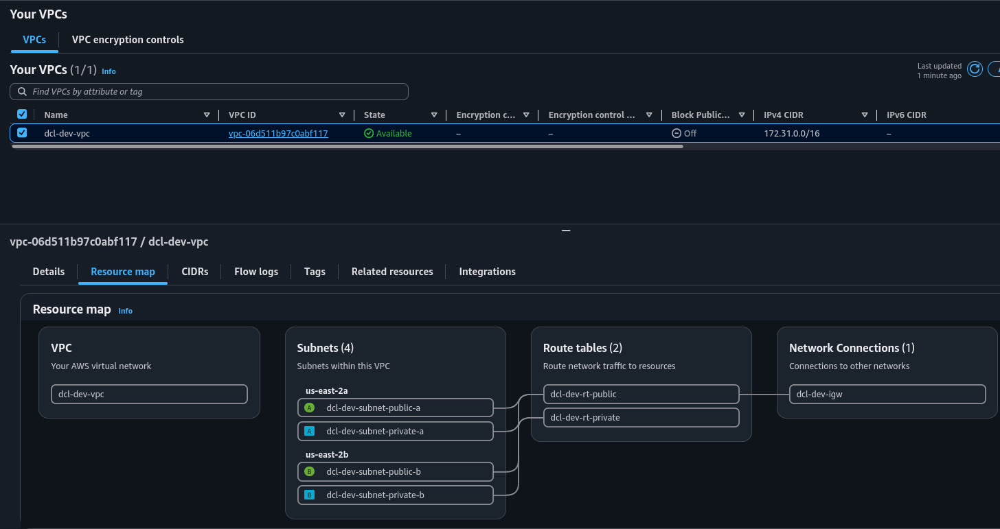
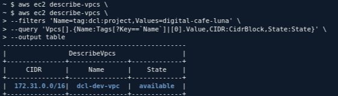
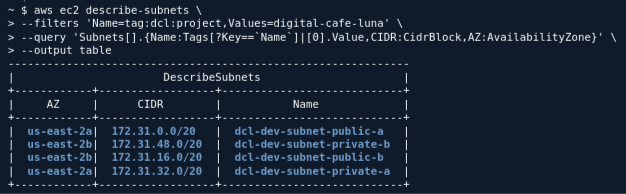
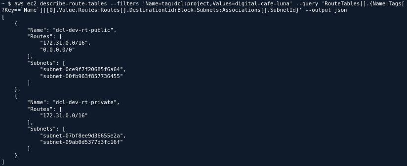
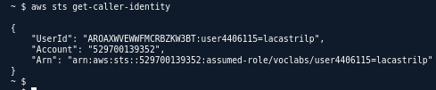
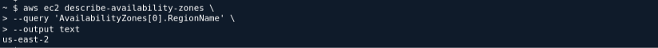

---

### ¿Qué cambiaría para que un recurso de una subred privada pudiera salir a Internet sin recibir conexiones iniciadas desde Internet?

**Respuesta:**

Se agregaría un **NAT Gateway** en una subred pública y se modificaría la tabla de rutas de la subred privada para que la ruta `0.0.0.0/0` apunte al NAT Gateway.

De esta manera:

```text
Recurso privado
      |
      v
Tabla de rutas privada
0.0.0.0/0 → NAT Gateway
      |
      v
NAT Gateway (subred pública)
      |
      v
Internet Gateway
      |
      v
Internet
```

El NAT Gateway permite que los recursos privados **inicien conexiones hacia Internet**, pero evita que Internet pueda iniciar directamente una conexión hacia esos recursos privados.

---

### ¿Qué elemento determina realmente que una subred sea pública?

**Respuesta:**

Lo determina **su tabla de rutas**, no el nombre de la subred.

Una subred es pública cuando su tabla de rutas tiene una ruta:

```text
0.0.0.0/0 → Internet Gateway
```

Una subred privada **no tiene una ruta directa hacia el Internet Gateway**.

Por eso, aunque la subred se llame `private-a`, lo que realmente define su carácter es el **enrutamiento asociado**. El propio laboratorio lo recalca explícitamente. 

---

### ¿Por qué dos subredes en la misma AZ no ofrecen tolerancia ante la falla de esa AZ?

**Respuesta:**

Porque una **Availability Zone es un límite de fallo**. Si ambas subredes están dentro de la misma AZ y esa AZ falla, las dos subredes quedan afectadas simultáneamente.

Para obtener redundancia frente a una falla de AZ, los recursos deben distribuirse entre **dos o más Availability Zones diferentes** dentro de la misma Región.

Ejemplo:

```text
Región us-east-1
│
├── AZ A
│   ├── subnet pública A
│   └── subnet privada A
│
└── AZ B
    ├── subnet pública B
    └── subnet privada B
```

El laboratorio precisamente plantea distribuir las cuatro subredes entre dos AZ para reducir la dependencia de una única ubicación. 

---

### ¿Qué responsabilidad conserva Digital Café Luna aunque AWS administre la infraestructura física?

**Respuesta:**

Digital Café Luna conserva la responsabilidad de **configurar, proteger y administrar correctamente sus recursos dentro de AWS**.

Esto incluye, entre otros:

* Configuración de la VPC y subredes.
* Tablas de rutas y conectividad.
* Reglas de seguridad y acceso.
* Configuración de los recursos desplegados.
* Control de las identidades y permisos.
* Protección de los datos y de las aplicaciones.

AWS administra la **infraestructura física subyacente**, pero eso no significa que AWS sea responsable de toda la configuración y seguridad de los recursos que Digital Café Luna despliega.

---

## Verificar la VPC

Consultar la VPC del proyecto:

```bash
aws ec2 describe-vpcs \
--filters 'Name=tag:dcl:project,Values=digital-cafe-luna' \
--query 'Vpcs[].{Name:Tags[?Key==`Name`]|[0].Value,CIDR:CidrBlock,State:State}' \
--output table
```



---

## Verificar las subredes

```bash
aws ec2 describe-subnets \
--filters 'Name=tag:dcl:project,Values=digital-cafe-luna' \
--query 'Subnets[].{Name:Tags[?Key==`Name`]|[0].Value,CIDR:CidrBlock,AZ:AvailabilityZone}' \
--output table
```


---

## Verificar tablas de rutas

```bash
aws ec2 describe-route-tables \
--filters 'Name=tag:dcl:project,Values=digital-cafe-luna' \
--query 'RouteTables[].{Name:Tags[?Key==`Name`]|[0].Value,Routes:Routes[].DestinationCidrBlock,Subnets:Associations[].SubnetId}' \
--output json
```



La diferencia clave es:

```text
PÚBLICA:
0.0.0.0/0 → Internet Gateway

PRIVADA:
10.20.0.0/16 → local
```
---

# Verificar sesión y Región


### Identidad de la sesión

```bash
aws sts get-caller-identity
```


 

### Región activa

```bash
aws ec2 describe-availability-zones \
--query 'AvailabilityZones[0].RegionName' \
--output text
```


---

1. **Salida de privada a Internet:** NAT Gateway en subnet pública + `0.0.0.0/0 → NAT Gateway` en la tabla privada.

2. **Qué hace pública una subnet:** Su **tabla de rutas**, específicamente una ruta `0.0.0.0/0 → Internet Gateway`.

3. **Dos subnets en la misma AZ:** No hay tolerancia ante la caída de esa AZ porque ambas comparten el mismo límite de fallo.

4. **Responsabilidad de Digital Café Luna:** Configurar y proteger sus recursos, accesos, red, datos y aplicaciones; AWS administra la infraestructura física.