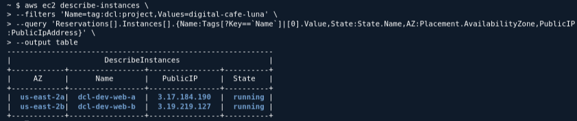
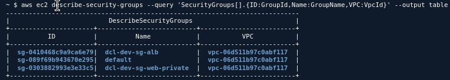
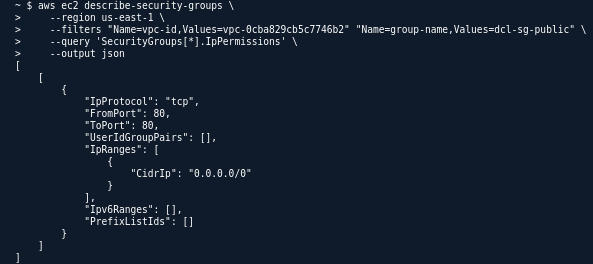
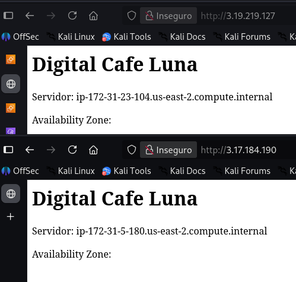
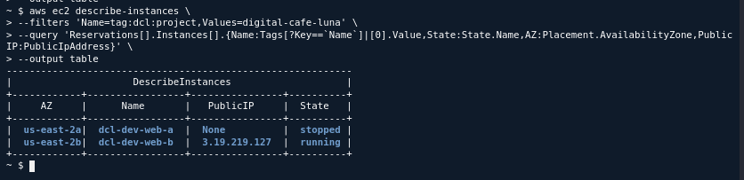
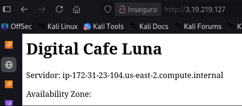

## 1. Estado de las dos instancias

```bash
aws ec2 describe-instances \
--filters 'Name=tag:dcl:project,Values=digital-cafe-luna' \
--query 'Reservations[].Instances[].{Name:Tags[?Key==`Name`]|[0].Value,State:State.Name,AZ:Placement.AvailabilityZone,PublicIP:PublicIpAddress}' \
--output table
```



---

# 2. Verificar Security Group

```bash
aws ec2 describe-security-groups \
--filters 'Name=group-name,Values=dcl-dev-sg-web' \
--query 'SecurityGroups[].{Name:GroupName,Inbound:IpPermissions}' \
--output json
```

```bash
aws ec2 describe-security-groups \
    --region us-east-1 \
    --filters "Name=vpc-id,Values=vpc-0cba829cb5c7746b2" "Name=group-name,Values=dcl-sg-public" \
    --query 'SecurityGroups[*].IpPermissions' \
    --output json
```




---

# 3. Prueba HTTP antes de la falla

Desde CloudShell puedes probar:

```bash
curl -i <IP-PUBLICA-A>
```

y:

```bash
curl -i <IP-PUBLICA-B>
```




El `user data` del laboratorio instala Apache y genera una página que identifica el servidor y su Availability Zone. 

---

# 4. Simular la falla de A

Ahora detén:

```text
dcl-dev-web-a
```

En la consola:

**EC2 → Instances → dcl-dev-web-a → Instance state → Stop instance**

Después hay que comprobar nuevamente A y B y **no reiniciar A todavía**. 

Después puedes verificar el estado con:

```bash
aws ec2 describe-instances \
--filters 'Name=tag:dcl:project,Values=digital-cafe-luna' \
--query 'Reservations[].Instances[].{Name:Tags[?Key==`Name`]|[0].Value,State:State.Name,AZ:Placement.AvailabilityZone,PublicIP:PublicIpAddress}' \
--output table
```



---

# 5. Probar que B continúa disponible

Prueba nuevamente B:

```bash
curl -i http://IP-B
```



Esto demuestra **redundancia**, pero no todavía failover. B continúa disponible, pero los usuarios que tenían el endpoint de A **no son redirigidos automáticamente**. 

---

# 6. Análisis del fallo

> **La falla de A afecta únicamente a la instancia A porque A y B están distribuidas en Availability Zones diferentes. B continúa funcionando porque pertenece a otro dominio de fallo. Sin embargo, el usuario que accede directamente a la IP pública de A no es enviado automáticamente a B. Por eso la arquitectura tiene redundancia, pero todavía no tiene failover automático.**

---

# 7. Diagrama v2

```text
                    Internet
                       |
             +---------+---------+
             |                   |
          AZ-A                 AZ-B
             |                   |
     Public Subnet A      Public Subnet B
             |                   |
       dcl-dev-web-a       dcl-dev-web-b
             |                   |
           FALLA                OK
          STOPPED              RUNNING
             |                   |
        HTTP falla          HTTP funciona
```

### Radio de impacto sobre A

```text
Falla:
dcl-dev-web-a
     ↓
Instancia A no disponible
     ↓
IP pública de A no responde

NO afecta:
dcl-dev-web-b
     ↓
B continúa disponible
```

**Importante:** la falla simulada es de la instancia A, no de toda la AZ. La distribución entre AZ demuestra que una falla localizada no elimina ambas unidades de cómputo.

---

# 8. ¿Qué falta para un único endpoint con health checks y failover automático?

### Respuesta 

> **Falta un Application Load Balancer (ALB), un Target Group con health checks y la configuración de los targets para que el tráfico se envíe únicamente a instancias saludables. De esta forma, el usuario utilizaría un único endpoint DNS y el ALB podría dejar de enviar tráfico a una instancia que falle.**

```text
ALB
 ↓
Target Group
 ↓
Health Checks
 ↓
Instancia A + Instancia B
```

Tendríamos:

```text
             Usuario
                |
                ↓
           Único endpoint
            DNS del ALB
                |
                ↓
          Application Load
             Balancer
                |
          +-----+-----+
          |           |
       Target A    Target B
       healthy      healthy
```

Si A falla:

```text
             Usuario
                |
                ↓
               ALB
                |
          +-----+-----+
          |           |
          A           B 
                      ↑
                recibe tráfico
```
