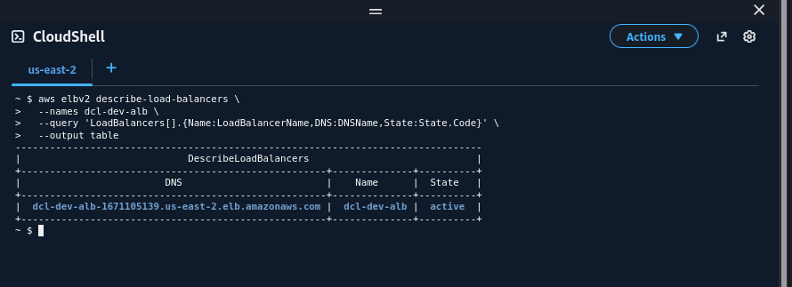
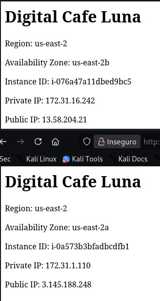
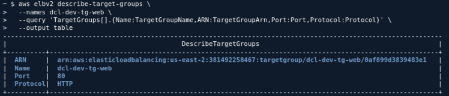
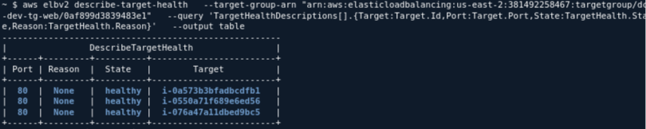
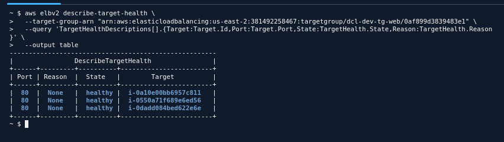

## 1. Arquitectura

```text
                         Internet
                            |
                            v
                  +-------------------+
                  |       ALB         |
                  |   dcl-dev-alb     |
                  |       :80         |
                  +---------+---------+
                            |
                       Target Group
                      dcl-dev-tg-web
                       /           \
                      v             v
             EC2 Instance A    EC2 Instance B
                  AZ 2a            AZ 2b
                     \             /
                      \           /
                      Auto Scaling
                          Group
                       desired = 2
```

La configuración del laboratorio pide:

* **Launch Template:** `dcl-dev-lt-web`
* **Target Group:** `dcl-dev-tg-web`
* **ALB:** `dcl-dev-alb`
* **ASG:** `dcl-dev-asg-web`
* Subnets públicas `a` y `b`
* ASG: **min = 2, desired = 2, max = 4**
* Health checks del ASG: **EC2**, sin habilitar ELB health checks como fuente adicional de reemplazo en este laboratorio. 

---

### ¿Qué responsabilidad cumple el ALB que antes recaía en el usuario que elegía una IP?

Antes, el usuario tenía que escoger directamente entre:

```text
http://IP-A
http://IP-B
```

El **ALB elimina esa decisión**. El usuario utiliza un único DNS y el ALB distribuye las solicitudes entre los targets disponibles.

En otras palabras:

> **El ALB abstrae las IP individuales de las instancias y proporciona un único punto de entrada para distribuir el tráfico.**

---

### ¿Qué determina que un target sea elegible para recibir nuevas solicitudes?

Principalmente, su **estado de salud dentro del Target Group**.

El Target Group determina qué destinos son elegibles para nuevas solicitudes. Si un target falla los health checks y existe otro healthy, el ALB deja de enviarle nuevas solicitudes. 

> **La elegibilidad depende del estado del target en el Target Group y de los health checks. Un target unhealthy deja de recibir nuevas solicitudes mientras exista otro target healthy.**

---

### ¿Por qué la Prueba A no equivale a la Prueba B?

Porque prueban **dos mecanismos diferentes**.

**Prueba A → Reboot**

La instancia sigue existiendo y permanece `Running`, pero su aplicación puede dejar temporalmente de responder. Se observa principalmente:

```text
EC2
  ↓
Target Group
  ↓
Health Check
  ↓
ALB deja de enviar tráfico al target no saludable
```

El propio laboratorio advierte que el ASG debe observarse y registrarse, **sin asumir previamente que reemplazará la instancia**. 

**Prueba B → Terminate**

La instancia desaparece realmente:

```text
EC2 terminada
      ↓
capacidad real < desired
      ↓
ASG detecta pérdida de capacidad
      ↓
lanza nueva instancia
      ↓
nuevo target
      ↓
healthy
      ↓
desired = 2
```

Esta sí está diseñada para demostrar de forma determinista el **reemplazo de capacidad**. 

---

### ¿Qué significa `desired = 2` cuando una instancia desaparece?

Significa que el ASG tiene como objetivo mantener **2 instancias en funcionamiento como capacidad deseada**.

Por ejemplo:

```text
ANTES

Desired = 2
Running = 2

EC2-A
EC2-B
```

Terminas EC2-A:

```text
DURANTE

Desired = 2
Running = 1
```

El ASG debe reponer la capacidad:

```text
DESPUÉS

Desired = 2
Running = 2

EC2-B
EC2-C  ← nueva
```

El laboratorio espera precisamente observar la caída temporal de capacidad y posteriormente el lanzamiento de una nueva instancia hasta recuperar `desired = 2`. 

---

# Evidencias

### ALB

Ejecuta:

```bash
aws elbv2 describe-load-balancers \
  --names dcl-dev-alb \
  --query 'LoadBalancers[].{Name:LoadBalancerName,DNS:DNSName,State:State.Code}' \
  --output table
```



---

### Dos respuestas HTTP diferentes

Abre:

```text
http://DNS-DEL-ALB
```

Refresca varias veces.



---

# Target Group

Necesitamos obtener primero el ARN:

```bash
aws elbv2 describe-target-groups \
  --names dcl-dev-tg-web \
  --query 'TargetGroups[].{Name:TargetGroupName,ARN:TargetGroupArn,Port:Port,Protocol:Protocol}' \
  --output table
```


Luego:

```bash
aws elbv2 describe-target-health \
  --target-group-arn "ARN_DEL_TARGET_GROUP" \
  --query 'TargetHealthDescriptions[].{Target:Target.Id,Port:Target.Port,State:TargetHealth.State,Reason:TargetHealth.Reason}' \
  --output table
```




### Antes de Prueba A

> Targets


> ASG 


> Instances 


### Durante Prueba A

> Targets


> ASG 


> Instances 


### Después Prueba A

> Targets


> ASG 


> Instances 


---

**Conclusión:** La instancia se recupera muy rapido al reiniciar, tanto que no cambia nada en ALB, ASG, Target groups, ni la instancia.

---

# Prueba B — TERMINATE

Aquí hacemos:

**EC2 → Instance state → Terminate instance**


### Antes de Prueba B

> Targets


> ASG 


> Instances 


### Durante Prueba B

> Targets


> ASG 


> Instances 


### Después Prueba B

> Targets


> ASG 


> Instances 


### Respuesta HTTP antes y despues


### Targets Finales



---

> **ALB = un único endpoint + distribución de tráfico + exclusión de targets no saludables.**
> **ASG = mantenimiento de la capacidad deseada mediante reemplazo de instancias terminadas.**