# LAB 2 — Aplicación desacoplada
## Digital Café Luna · AWS · Sesión 10 · Evidencias, criterios de aceptación y guía de implementación

> **Documento base:** LAB 2 — Aplicación desacoplada: productor y consumidor sin dependencia temporal.  
> **Duración:** 100–110 minutos · **Modalidad:** equipos de 4 · **Peso evaluativo:** 10 %.  
> **Región obligatoria:** `us-east-1`.

---

# 1. Objetivo del laboratorio

Implementar un flujo asíncrono en el que:

```text
producer.py → Amazon SQS Standard → consumer.py → resultado observable
```

El productor envía mensajes a una cola SQS y el consumidor los procesa cuando están disponibles. La evidencia principal consiste en detener el consumidor, continuar enviando mensajes, observar el backlog y después reactivar el consumidor para procesar los mensajes pendientes.

## Alcance técnico

Este laboratorio demuestra:

- Desacoplamiento temporal y lógico.
- Uso de Amazon SQS Standard como intermediario.
- Uso de IAM Role / Instance Profile y credenciales temporales.
- Procesamiento exitoso mediante `ReceiveMessage` y `DeleteMessage`.
- `VisibilityTimeout`, reintentos y entregas `at-least-once`.
- Backlog cuando el consumidor está detenido.

**Limitación importante:** productor y consumidor se ejecutan dentro de una sola EC2. Si la EC2 falla, ambos procesos se detienen. El laboratorio no demuestra aislamiento frente a una falla de instancia.

---

# 2. Arquitectura esperada

```text
                         AWS
┌──────────────────────────────────────────────────────────┐
│ us-east-1                                                │
│                                                          │
│  EC2: dcl-dev-lab2-worker                                │
│  ┌────────────────────┐       ┌──────────────────────┐   │
│  │ producer.py        │──────▶│ SQS Standard         │   │
│  │ SendMessage        │       │ dcl-dev-orders-queue │   │
│  └────────────────────┘       └──────────┬───────────┘   │
│                                          │               │
│  ┌────────────────────┐                  │               │
│  │ consumer.py        │◀─────────────────┘               │
│  │ ReceiveMessage     │                                  │
│  │ Process            │                                  │
│  │ DeleteMessage      │                                  │
│  └────────────────────┘                                  │
└──────────────────────────────────────────────────────────┘
```
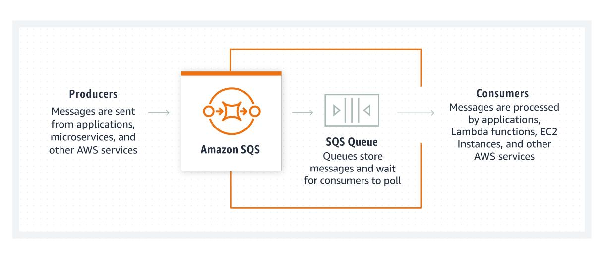
## Recursos esperados

| Recurso | Nombre/configuración |
|---|---|
| Región | `us-east-1` |
| EC2 | `dcl-dev-lab2-worker` |
| Sistema operativo | Amazon Linux 2023 |
| Tipo | Pequeño y elegible en la cuenta |
| Security Group | `dcl-dev-sg-lab2` |
| IAM Role | `dcl-dev-role-lab2-sqs` |
| Instance Profile | Asociado a la EC2 |
| Cola | `dcl-dev-orders-queue` |
| Tipo de cola | Standard |
| Visibility timeout | 30 segundos |
| Receive message wait time | 5 segundos |
| Productor | `producer.py` |
| Consumidor | `consumer.py` |

Etiquetas sugeridas:

```text
dcl:project=digital-cafe-luna
dcl:environment=dev
dcl:owner-team=team-01
dcl:managed-by=console
```

---

# 3. Criterios de aceptación

## 3.1 Matriz general

| Criterio | Resultado esperado | Evidencia |
|---|---|---|
| Arquitectura | Una EC2 ejecuta productor y consumidor; SQS media entre ambos | Diagrama y captura de recursos |
| IAM | La EC2 usa Instance Profile; no existen Access Keys en los scripts | `aws sts get-caller-identity` y revisión de código |
| Cola | SQS Standard creada con timeout de 30 s y long polling de 5 s | Consola y CLI |
| Happy path | `SendMessage → ReceiveMessage → procesamiento → DeleteMessage` | Terminal del productor y consumidor |
| Desacoplamiento | Con consumidor detenido, el productor continúa enviando | Terminal del productor + estado de EC2 |
| Backlog | Se observan tres mensajes visibles | Consulta de atributos SQS |
| Recuperación | Al reactivar el consumidor, los tres mensajes son procesados | Terminal del consumidor + backlog final |
| Fallo/retry | Mensaje fallido no se elimina, queda temporalmente invisible y reaparece | MessageId repetido y atributos SQS |
| Semántica SQS | Se reconoce `at-least-once` y orden best-effort | Explicación técnica |
| Seguridad | SSH solo desde My IP y permisos mínimos sobre la cola | Security Group e IAM Policy |
| Cleanup | Recursos exclusivos del laboratorio eliminados | Capturas finales y comandos de verificación |

## 3.2 Requisitos funcionales mínimos

La entrega debe demostrar:

1. Productor y consumidor como procesos independientes.
2. Cola SQS Standard funcional.
3. Identidad de la EC2 mediante IAM Role.
4. Happy path con `DCL-001`.
5. Consumidor apagado y producción de `DCL-002`, `DCL-003` y `DCL-004`.
6. Backlog aproximado de tres mensajes visibles.
7. Reactivación del consumidor y backlog final aproximado de cero.
8. Mensaje `DCL-FAIL-001` con fallo simulado.
9. Reaparición del mismo `MessageId` después del visibility timeout.
10. Evidencias antes, durante y después de cada prueba.

---

# 4. Rúbrica evaluativa

| Criterio | Peso | Qué debe demostrarse |
|---|---:|---|
| Implementación técnica | 30 % | EC2, IAM Role/Profile, SQS, `producer.py` y `consumer.py` funcionales |
| Validación funcional | 20 % | Happy path, backlog OFF/ON y retry |
| Arquitectura y buenas prácticas | 15 % | Desacoplamiento, permisos mínimos y semántica correcta de SQS |
| Seguridad, costos y cleanup | 10 % | Sin credenciales hardcoded, SSH restringido y limpieza completa |
| Evidencias y documentación | 15 % | Evidencias antes/durante/después y trazabilidad de MessageId/backlog |
| Colaboración y defensa | 10 % | Roles, contribuciones y explicación técnica por cualquier integrante |
| **Total** | **100 %** | |

---

# 5. Distribución sugerida del trabajo en equipo

| Rol | Responsabilidad |
|---|---|
| Alejo 1 — Infraestructura | VPC, subnet, EC2 y Security Group |
| Alberto 2 — Seguridad | IAM Role, policy e Instance Profile |
| Marin 3 — Aplicación | `producer.py` y `consumer.py` |
| Pau 4 — Evidencias | Capturas, comandos, trazabilidad y documento |

Todos los integrantes deben comprender:

- Por qué SQS desacopla al productor del consumidor.
- Qué representa `ReceiveMessage`.
- Por qué se utiliza `DeleteMessage`.
- Qué es `VisibilityTimeout`.
- Por qué SQS Standard no garantiza orden estricto.
- Qué implica `at-least-once`.
- Qué limitación tiene ejecutar ambos procesos en una sola EC2.

---

# 6. Guía paso a paso desde la consola AWS

## Fase 0 — Verificar región y red

1. Ingresar a la consola de AWS.
2. Seleccionar la región **US East (N. Virginia) — `us-east-1`**.
3. Abrir **VPC → Your VPCs**.
4. Identificar una VPC disponible.
5. Abrir **VPC → Subnets**.
6. Seleccionar una subnet con salida a Internet.
7. Verificar su tabla de rutas:
   - Debe existir una ruta `0.0.0.0/0`.
   - El destino debe ser un Internet Gateway.
8. Confirmar que la subnet permita asignación de IPv4 pública.
9. Reutilizar infraestructura existente únicamente si está disponible y es necesaria.

### Evidencia F0

Capturar:

- Región seleccionada.
- VPC y CIDR.
- Subnet y Availability Zone.
- Tabla de rutas con `0.0.0.0/0 → Internet Gateway`.


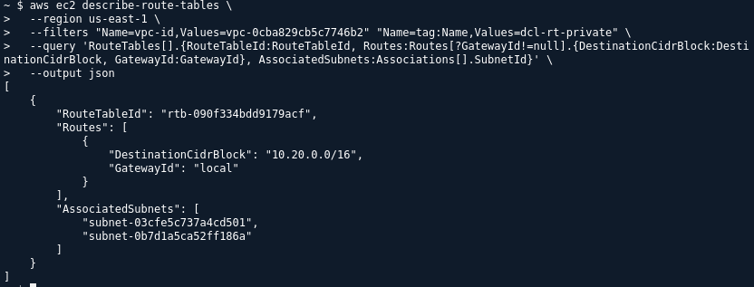 
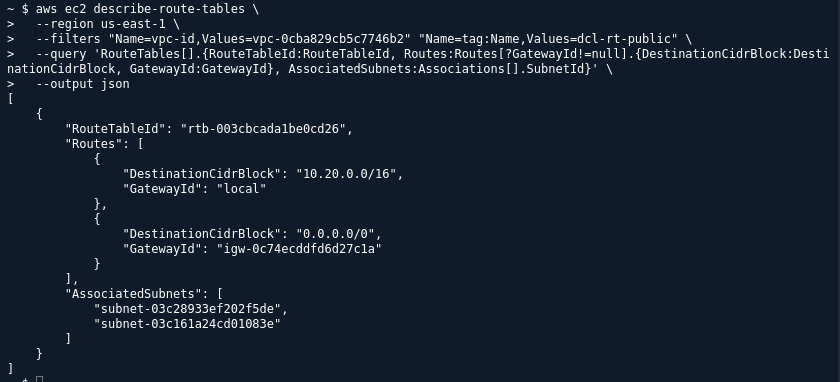 
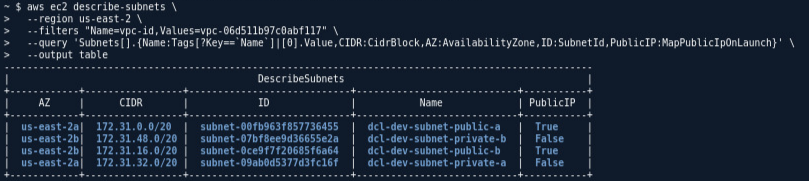 
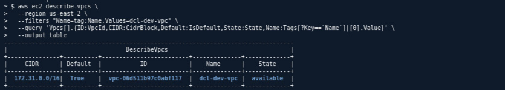

---

## Fase 1 — Crear la cola SQS

1. Abrir **Amazon SQS**.
2. Seleccionar **Create queue**.
3. Tipo: **Standard**.
4. Nombre:

```text
dcl-dev-orders-queue
```

5. Configurar:
   - Visibility timeout: `30 seconds`.
   - Receive message wait time: `5 seconds`.
6. Mantener el resto de valores predeterminados, salvo instrucción del docente.
7. Crear la cola.
8. Copiar y guardar:
   - Queue URL.
   - Queue ARN.

### Evidencia F1

Capturar la configuración de la cola y guardar:

```text
Queue URL:
Queue ARN:
Type: Standard
Visibility timeout: 30 seconds
Receive message wait time: 5 seconds
```

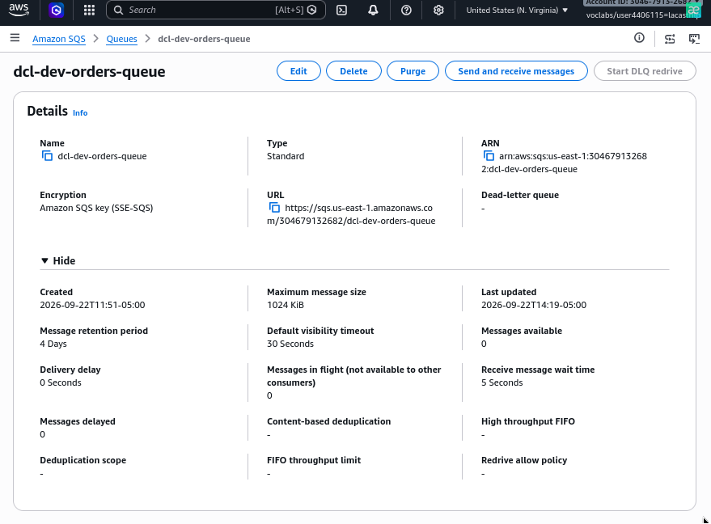

---

## Fase 2 — Crear IAM Role e Instance Profile

### 2.1 Crear el Role

1. Abrir **IAM → Roles**.
2. Seleccionar **Create role**.
3. Trusted entity: **AWS service**.
4. Use case: **EC2**.
5. Nombre:

```text
dcl-dev-role-lab2-sqs
```

6. Crear una policy personalizada de mínimo privilegio.
7. Asociar la policy al role.

### 2.2 Policy mínima

Reemplazar `ACCOUNT_ID` por el ID real de la cuenta:

```json
{
  "Version": "2012-10-17",
  "Statement": [
    {
      "Effect": "Allow",
      "Action": [
        "sqs:GetQueueAttributes",
        "sqs:SendMessage",
        "sqs:ReceiveMessage",
        "sqs:DeleteMessage"
      ],
      "Resource": "arn:aws:sqs:us-east-1:ACCOUNT_ID:dcl-dev-orders-queue"
    }
  ]
}
```

### Recomendaciones de seguridad

- No agregar `sqs:*`.
- No usar permisos sobre todas las colas.
- No crear Access Keys para el script.
- La policy debe apuntar exclusivamente a `dcl-dev-orders-queue`.
- Confirmar que el role se pueda seleccionar como Instance Profile al lanzar la EC2.

### Evidencia F2

Capturar:

- Nombre del role.
- Trust relationship para EC2.
- Policy JSON.
- ARN del recurso SQS.
- Ausencia de permisos amplios.

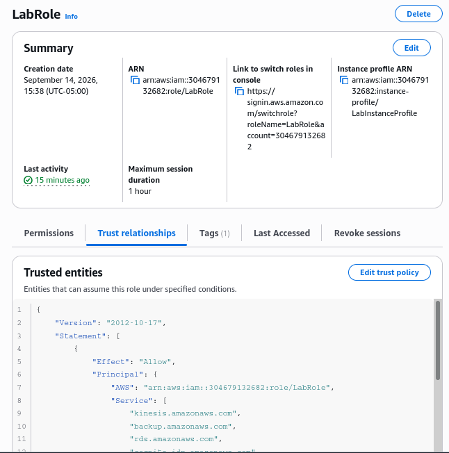

---

## Fase 3 — Lanzar la EC2

1. Abrir **EC2 → Instances → Launch instances**.
2. Nombre:

```text
dcl-dev-lab2-worker
```

3. AMI: **Amazon Linux 2023**.
4. Tipo: instancia pequeña elegible.
5. Seleccionar la VPC y subnet verificadas.
6. Activar **Auto-assign public IP**.
7. En IAM Instance Profile, seleccionar:

```text
dcl-dev-role-lab2-sqs
```

8. Seleccionar un key pair disponible.
9. Crear o seleccionar el Security Group:

```text
dcl-dev-sg-lab2
```

10. Regla de entrada:
    - Type: SSH.
    - Protocol: TCP.
    - Port: 22.
    - Source: My IP.
11. Mantener el egress necesario para HTTPS/443.
12. Lanzar la instancia.
13. Esperar `Running` y `2/2 checks passed` o el estado de comprobación mostrado por la consola.
14. Conectarse como `ec2-user`.

### Evidencia F3

Capturar:

- Instance ID.
- Nombre.
- Estado `Running`.
- Availability Zone.
- IPv4 pública.
- IAM Role asociado.
- Security Group y regla SSH restringida.
- Subnet y VPC.


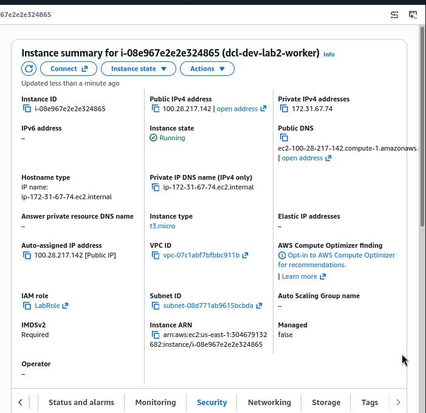
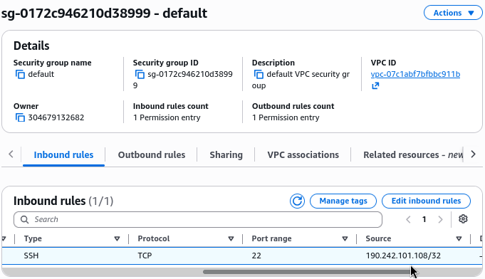

---

# 7. Preparar la EC2

Ejecutar desde la EC2:

```bash
aws sts get-caller-identity
```

La salida debe mostrar la identidad asociada al IAM Role, no una Access Key configurada manualmente.

Instalar Python 3.11:

```bash
sudo dnf install -y python3.11 python3.11-pip
```

Verificar:

```bash
python3.11 --version
```

Instalar Boto3:

```bash
python3.11 -m pip install --user boto3
```

Configurar variables:

```bash
export AWS_REGION=us-east-1
export QUEUE_URL="https://sqs.us-east-1.amazonaws.com/ACCOUNT_ID/dcl-dev-orders-queue"
```

Verificar:

```bash
echo "$AWS_REGION"
echo "$QUEUE_URL"
aws sts get-caller-identity
```

> No incluir Access Key ID ni Secret Access Key en archivos `.py`, variables permanentes o capturas.

---

# 8. Crear `producer.py`

Ejecutar:

```bash
cat > producer.py <<'PY'
import boto3
import json
import os
import sys
from datetime import datetime, timezone

queue_url = os.environ["QUEUE_URL"]
region = os.getenv("AWS_REGION", "us-east-1")
sqs = boto3.client("sqs", region_name=region)

order_id = sys.argv[1] if len(sys.argv) > 1 else "DCL-001"
simulate_failure = "--fail" in sys.argv

body = {
    "orderId": order_id,
    "type": "ORDER_CREATED",
    "createdAt": datetime.now(timezone.utc).isoformat(),
    "simulateFailure": simulate_failure
}

response = sqs.send_message(
    QueueUrl=queue_url,
    MessageBody=json.dumps(body)
)

print(
    f"SENT orderId={order_id} "
    f"MessageId={response['MessageId']} "
    f"fail={simulate_failure}"
)
PY
```

Validar sintaxis:

```bash
python3.11 -m py_compile producer.py
```

Probar envío:

```bash
python3.11 producer.py DCL-TEST-001
```

Salida esperada:

```text
SENT orderId=DCL-TEST-001 MessageId=<id> fail=False
```

---

# 9. Crear `consumer.py`

Ejecutar:

```bash
cat > consumer.py <<'PY'
import boto3
import json
import os
import time

queue_url = os.environ["QUEUE_URL"]
region = os.getenv("AWS_REGION", "us-east-1")
sqs = boto3.client("sqs", region_name=region)

print("Consumer ON. Ctrl+C para detener.")

while True:
    response = sqs.receive_message(
        QueueUrl=queue_url,
        MaxNumberOfMessages=1,
        WaitTimeSeconds=5,
        VisibilityTimeout=30,
        AttributeNames=["ApproximateReceiveCount"]
    )

    for message in response.get("Messages", []):
        body = json.loads(message["Body"])
        count = message.get("Attributes", {}).get(
            "ApproximateReceiveCount", "?"
        )

        print(
            f"RECEIVED MessageId={message['MessageId']} "
            f"orderId={body.get('orderId')} "
            f"receiveCount={count}"
        )

        if body.get("simulateFailure"):
            print("PROCESSING FAILED — message NOT deleted")
            continue

        time.sleep(2)

        print(f"PROCESSED orderId={body.get('orderId')}")

        sqs.delete_message(
            QueueUrl=queue_url,
            ReceiptHandle=message["ReceiptHandle"]
        )

        print(f"DELETED MessageId={message['MessageId']}")
PY
```

Validar sintaxis:

```bash
python3.11 -m py_compile consumer.py
```

Verificar que el código contenga explícitamente:

```text
WaitTimeSeconds=5
VisibilityTimeout=30
DeleteMessage mediante ReceiptHandle
```

---

# 10. Evidencias y pruebas funcionales

## 10.1 Organización de terminales

Utilizar dos sesiones SSH contra la misma EC2:

- **Terminal A:** consumidor.
- **Terminal B:** productor y consultas.

En ambas terminales configurar:

```bash
export AWS_REGION=us-east-1
export QUEUE_URL="URL_REAL_DE_LA_COLA"
```

---

## 10.2 Prueba 0 — Baseline / estado inicial

Antes de ejecutar las pruebas, consultar:

```bash
aws sts get-caller-identity
```

```bash
aws sqs get-queue-attributes \
  --queue-url "$QUEUE_URL" \
  --attribute-names \
    VisibilityTimeout \
    ReceiveMessageWaitTimeSeconds \
    QueueArn \
  --query 'Attributes' \
  --output table
```

```bash
aws sqs get-queue-attributes \
  --queue-url "$QUEUE_URL" \
  --attribute-names \
    ApproximateNumberOfMessages \
    ApproximateNumberOfMessagesNotVisible \
  --query 'Attributes' \
  --output table
```

### Evidencias antes

Guardar:

- Estado de la EC2.
- Identidad del role.
- Configuración de SQS.
- Backlog inicial.
- Código compilado correctamente.
- Variables `AWS_REGION` y `QUEUE_URL` sin exponer información sensible innecesaria.


---

## 10.3 Prueba 1 — Happy path

### Paso A — Encender consumidor

En Terminal A:

```bash
python3.11 consumer.py
```

Salida esperada:

```text
Consumer ON. Ctrl+C para detener.
```

### Paso B — Enviar pedido

En Terminal B:

```bash
python3.11 producer.py DCL-001
```

### Resultado esperado

En el consumidor debe observarse una secuencia equivalente a:

```text
RECEIVED MessageId=<id> orderId=DCL-001 receiveCount=1
PROCESSED orderId=DCL-001
DELETED MessageId=<id>
```

### Validación

El pedido debe:

1. Ser enviado.
2. Ser recibido.
3. Ser procesado.
4. Ser eliminado después del procesamiento exitoso.

### Evidencias durante

- Salida de `producer.py` con `MessageId`.
- Salida de `consumer.py` con `RECEIVED`.
- Salida `PROCESSED`.
- Salida `DELETED`.
- Consulta de cola sin mensajes visibles, considerando que los atributos son aproximados.

---
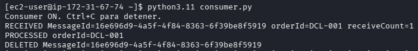
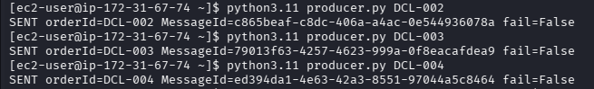

## 10.4 Prueba 2 — Desacoplamiento: Consumer OFF → backlog → Consumer ON

### Antes

Con el consumidor detenido, confirmar que la EC2 sigue activa:

```bash
aws ec2 describe-instances \
  --filters \
    "Name=tag:Name,Values=dcl-dev-lab2-worker" \
    "Name=instance-state-name,Values=running" \
  --query 'Reservations[].Instances[].{InstanceId:InstanceId,State:State.Name,PublicIP:PublicIpAddress}' \
  --output table
```

Detener el consumidor en Terminal A:

```text
Ctrl+C
```

### Durante: producir tres mensajes

En Terminal B:

```bash
python3.11 producer.py DCL-002
python3.11 producer.py DCL-003
python3.11 producer.py DCL-004
```

Consultar backlog:

```bash
aws sqs get-queue-attributes \
  --queue-url "$QUEUE_URL" \
  --attribute-names \
    ApproximateNumberOfMessages \
    ApproximateNumberOfMessagesNotVisible \
  --query 'Attributes' \
  --output table
```

### Checkpoint obligatorio

Debe quedar demostrado:

```text
Consumer = OFF
Producer = OK
EC2 = Running
Backlog visible aproximado = 3
```

### Después: reactivar consumidor

En Terminal A:

```bash
python3.11 consumer.py
```

Observar el procesamiento de:

```text
DCL-002
DCL-003
DCL-004
```

Consultar nuevamente:

```bash
aws sqs get-queue-attributes \
  --queue-url "$QUEUE_URL" \
  --attribute-names \
    ApproximateNumberOfMessages \
    ApproximateNumberOfMessagesNotVisible \
  --query 'Attributes' \
  --output table
```

### Resultado esperado

- Los tres pedidos son procesados.
- El backlog final observado es aproximadamente `0`.
- El orden exacto no se considera criterio de aceptación.
- La EC2 nunca se detuvo durante la prueba.

### Evidencias requeridas

| Momento | Evidencia |
|---|---|
| Antes | Consumidor activo y cola sin backlog relevante |
| Durante | Consumidor detenido, productor enviando tres mensajes |
| Durante | EC2 en `Running` |
| Durante | Backlog aproximado igual a 3 |
| Después | Consumidor reactivado y mensajes procesados |
| Después | Backlog final aproximado igual a 0 |

> Los atributos `ApproximateNumberOfMessages*` son aproximados. Deben complementarse con las salidas del productor y consumidor.


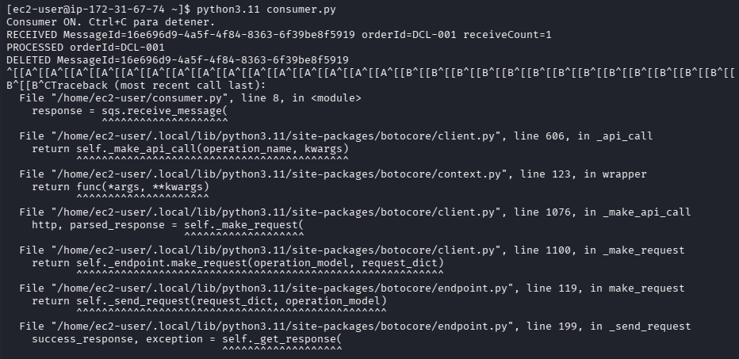
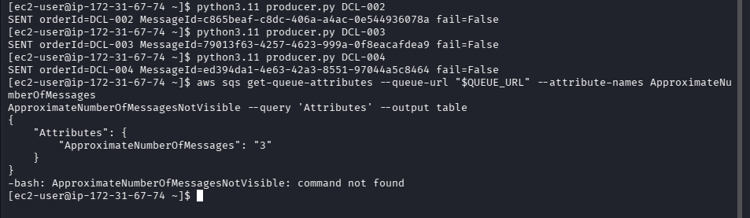
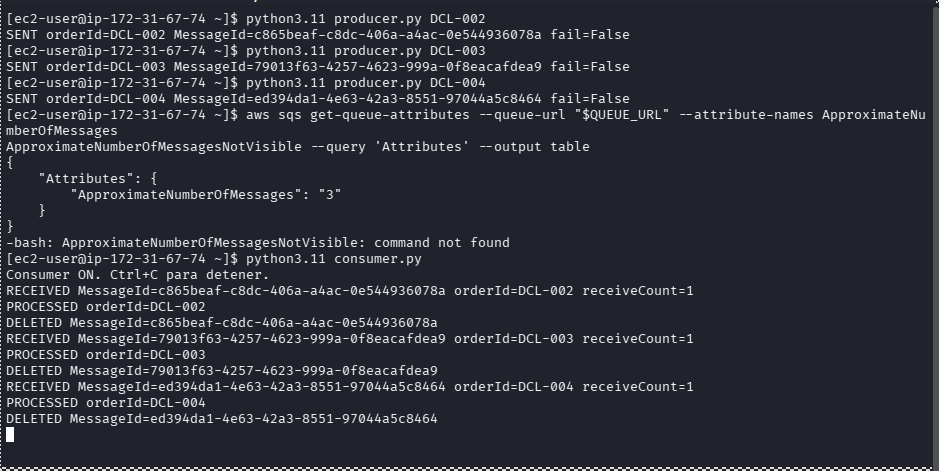


---

## 10.5 Prueba 3 — Fallo controlado, visibility timeout y retry

### Paso A — Enviar mensaje fallido

Con el consumidor activo:

```bash
python3.11 producer.py DCL-FAIL-001 --fail
```

Guardar el `MessageId` mostrado.

### Paso B — Observar el fallo

En Terminal A debe aparecer:

```text
RECEIVED MessageId=<id> orderId=DCL-FAIL-001 receiveCount=1
PROCESSING FAILED — message NOT deleted
```

No debe aparecer:

```text
DELETED MessageId=<id>
```

### Paso C — Consultar mensajes no visibles

Inmediatamente después de la recepción:

```bash
aws sqs get-queue-attributes \
  --queue-url "$QUEUE_URL" \
  --attribute-names \
    ApproximateNumberOfMessages \
    ApproximateNumberOfMessagesNotVisible \
  --query 'Attributes' \
  --output table
```

El mensaje puede aparecer temporalmente como no visible/in-flight.

### Paso D — Esperar el retry

Esperar aproximadamente 30 segundos desde la recepción. Observar que el mismo `MessageId` vuelva a recibirse.

El `ReceiptHandle` puede cambiar en cada recepción.

### Paso E — Detener el consumidor

Después de confirmar el retry:

```text
Ctrl+C
```

Esto evita un ciclo indefinido de reintentos durante la práctica.

### Resultado esperado

- El mensaje es recibido.
- El procesamiento falla de forma intencional.
- No se ejecuta `DeleteMessage`.
- El mensaje queda temporalmente invisible.
- Después de aproximadamente 30 segundos reaparece.
- El mismo `MessageId` se observa nuevamente.
- El contador de recepción puede aumentar.

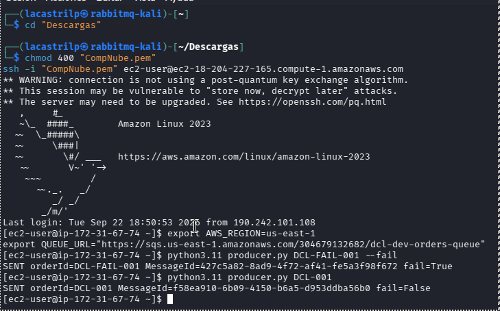
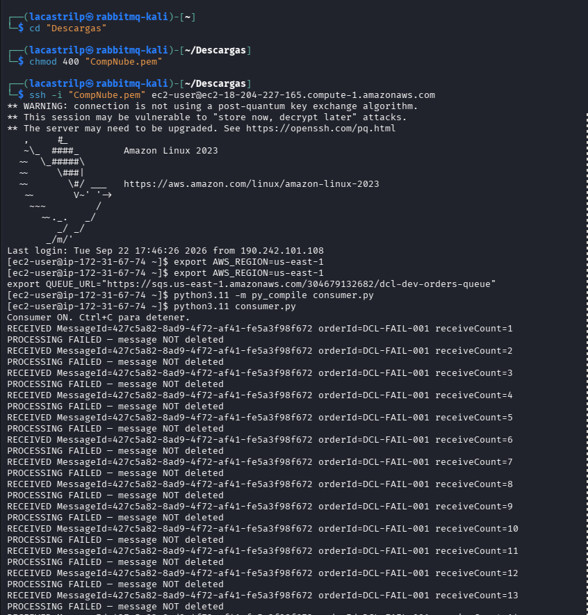

---

# 11. Consultas AWS CLI para evidencias

## 11.1 Identidad de la EC2

```bash
aws sts get-caller-identity
```
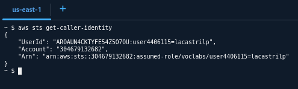

Uso: comprobar que Boto3 y AWS CLI usan la identidad temporal del Instance Profile.

---

## 11.2 Datos de la EC2

```bash
aws ec2 describe-instances \
  --filters "Name=tag:Name,Values=dcl-dev-lab2-worker" \
  --query 'Reservations[].Instances[].{
    InstanceId:InstanceId,
    Name:Tags[?Key==`Name`]|[0].Value,
    State:State.Name,
    AZ:Placement.AvailabilityZone,
    PublicIP:PublicIpAddress,
    PrivateIP:PrivateIpAddress,
    SubnetId:SubnetId,
    VpcId:VpcId,
    IAMProfile:IamInstanceProfile.Arn
  }' \
  --output table
```
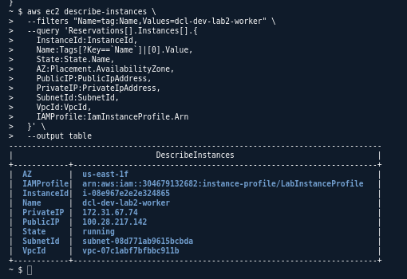

---

## 11.3 Security Group

Primero obtener el ID del grupo:

```bash
aws ec2 describe-security-groups \
  --filters "Name=group-name,Values=default" \
  --query 'SecurityGroups[].{GroupId:GroupId,GroupName:GroupName,VpcId:VpcId}' \
  --output table
```

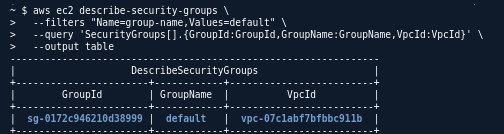

Consultar reglas:

```bash
aws ec2 describe-security-groups \
  --group-names default \
  --query 'SecurityGroups[].IpPermissions' \
  --output json
```

Validar que SSH/22 no tenga origen `0.0.0.0/0`.

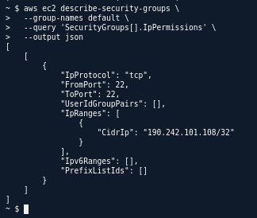

---

## 11.4 Configuración de la cola

```bash
aws sqs get-queue-attributes \
  --queue-url "$QUEUE_URL" \
  --attribute-names \
    VisibilityTimeout \
    ReceiveMessageWaitTimeSeconds \
    QueueArn \
  --query 'Attributes' \
  --output table
```

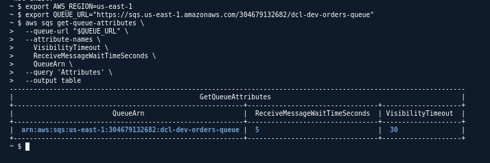

---

## 11.5 Backlog

```bash
aws sqs get-queue-attributes \
  --queue-url "$QUEUE_URL" \
  --attribute-names \
    ApproximateNumberOfMessages \
    ApproximateNumberOfMessagesNotVisible \
  --query 'Attributes' \
  --output table
```

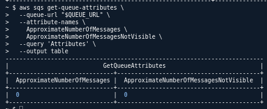

Interpretación:

| Atributo | Significado |
|---|---|
| `ApproximateNumberOfMessages` | Mensajes visibles aproximadamente |
| `ApproximateNumberOfMessagesNotVisible` | Mensajes recibidos pero temporalmente invisibles |
| `VisibilityTimeout` | Tiempo durante el cual un mensaje recibido no se muestra a otros consumidores |
| `ReceiveMessageWaitTimeSeconds` | Tiempo de long polling |

---

## 11.6 Revisar código sin credenciales

```bash
grep -RniE \
  'aws_access_key_id|aws_secret_access_key|AKIA|aws_session_token' \
  producer.py consumer.py
```

Lo ideal es que no aparezcan credenciales estáticas.

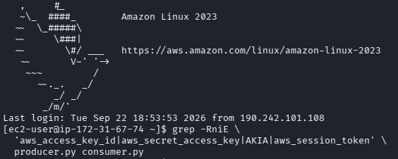

Consultar los archivos:

```bash
sed -n '1,240p' producer.py
```

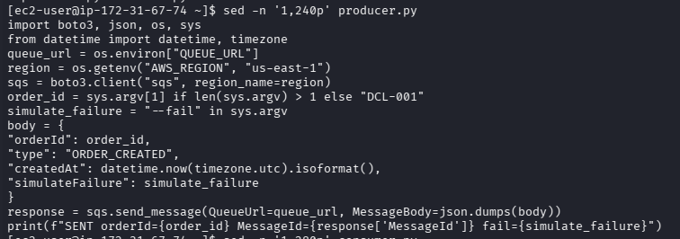

```bash
sed -n '1,280p' consumer.py
```

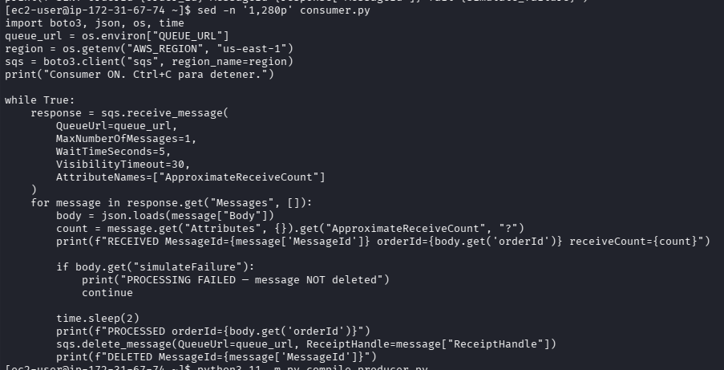

---

## 11.7 Validar sintaxis

```bash
python3.11 -m py_compile producer.py
python3.11 -m py_compile consumer.py
```


---

# 13. Respuestas técnicas para la defensa

## 13.1 ¿Qué evidencia demuestra que el productor no depende de que el consumidor esté ejecutándose?

La evidencia es la prueba `Consumer OFF → backlog → Consumer ON`:

1. Se detiene únicamente `consumer.py`.
2. La EC2 permanece en estado `Running`.
3. `producer.py` envía `DCL-002`, `DCL-003` y `DCL-004` correctamente.
4. SQS conserva los mensajes y se observa un backlog aproximado de tres mensajes.
5. Al reactivar el consumidor, los mensajes son procesados.

Esto demuestra desacoplamiento temporal: el productor puede terminar su trabajo de envío aunque el consumidor esté detenido.

---

## 13.2 ¿Por qué `ReceiveMessage` no significa que el trabajo ya fue completado?

`ReceiveMessage` únicamente entrega el mensaje al consumidor y lo vuelve temporalmente invisible durante el visibility timeout. El trabajo se considera confirmado cuando el procesamiento termina correctamente y el consumidor ejecuta `DeleteMessage`.

Si el consumidor falla o no elimina el mensaje, este puede reaparecer después del timeout y ser procesado nuevamente.

---

## 13.3 ¿Qué función cumple el visibility timeout?

El visibility timeout evita que un mensaje recibido sea visible inmediatamente para otros consumidores durante un periodo determinado.

En este laboratorio es de 30 segundos. Si el mensaje no se elimina dentro de ese tiempo, puede volver a estar disponible y ser recibido otra vez. Esto permite los reintentos, pero también exige que el consumidor tolere posibles entregas repetidas.

---

## 13.4 ¿Por qué el orden de una cola Standard no debe asumirse como estricto?

Amazon SQS Standard está diseñada para alta disponibilidad y escalabilidad, con entrega `at-least-once` y orden best-effort. Por tanto:

- Los mensajes pueden recibirse en un orden diferente al de envío.
- Puede ocurrir más de una entrega.
- El orden exacto no es criterio de aceptación en este laboratorio.
- Si se requiere orden estricto, se debe evaluar otro diseño, como una cola FIFO, aunque no forma parte de esta práctica.

---

## 13.5 ¿Qué riesgo permanece por ejecutar ambos procesos dentro de una sola EC2?

Existe un único punto de falla para los procesos. Si la EC2 falla, se detienen tanto el productor como el consumidor. SQS puede conservar mensajes pendientes, pero no habrá consumidor activo en esa instancia para procesarlos.

El laboratorio demuestra desacoplamiento temporal, no alta disponibilidad ni aislamiento ante fallas de cómputo.

---

## 13.6 ¿Qué función cumple `DeleteMessage`?

`DeleteMessage` confirma que el consumidor terminó correctamente el procesamiento del mensaje. Debe ejecutarse usando el `ReceiptHandle` correspondiente a la recepción actual, no utilizando el `MessageId`.

---

## 13.7 ¿Por qué se utiliza un IAM Role?

El IAM Role permite que la EC2 obtenga credenciales temporales mediante su Instance Profile. Esto evita guardar Access Key ID y Secret Access Key dentro del código y permite aplicar permisos mínimos sobre la cola del laboratorio.

---

## 13.8 ¿Qué diferencia existe entre interacción síncrona y asíncrona?

En una interacción síncrona, el productor normalmente espera una respuesta o disponibilidad inmediata del componente receptor.

En este flujo asíncrono, el productor envía el mensaje a SQS y puede finalizar sin que el consumidor esté ejecutándose. La cola conserva temporalmente el trabajo hasta que el consumidor esté disponible.

---

## 13.9 Conceptos clave: `at-least-once` y orden best-effort

### ¿Qué significa `at-least-once`?

Significa que SQS intenta entregar cada mensaje al menos una vez, pero no garantiza que se entregue una sola vez. Por eso un mismo mensaje puede recibirse nuevamente, incluso después de un procesamiento aparentemente exitoso.

La aplicación debe tolerar duplicados. En este laboratorio, el `MessageId` permite demostrar que el mismo mensaje reapareció después de no ejecutar `DeleteMessage`.

### ¿Qué significa orden best-effort?

Significa que SQS Standard intenta conservar el orden de envío cuando es posible, pero no lo garantiza. Por ejemplo, se pueden enviar `DCL-002`, `DCL-003` y `DCL-004` y recibirlos en otro orden.

`At-least-once` responde a la pregunta “¿cuántas veces puede llegar un mensaje?”. Orden best-effort responde a “¿en qué orden pueden llegar los mensajes?”. Son propiedades diferentes.

Si el sistema necesita orden estricto, debe evaluarse una cola SQS FIFO y un diseño compatible con sus restricciones. Este laboratorio utiliza una cola Standard.

---

## 13.10 ¿Qué revisar si algo falla?

| Síntoma | Qué revisar primero | Comando o evidencia |
|---|---|---|
| `AccessDenied` | Identidad de la EC2, Instance Profile, ARN de la cola y acciones permitidas | `aws sts get-caller-identity` y policy IAM |
| `QueueDoesNotExist` | Región, Queue URL y nombre exacto de la cola | `echo "$AWS_REGION"` y `echo "$QUEUE_URL"` |
| El productor no envía | Variables de entorno, conectividad HTTPS y permiso `sqs:SendMessage` | `echo "$QUEUE_URL"` y salida de `producer.py` |
| El consumidor no recibe | Queue URL, región, long polling y permiso `sqs:ReceiveMessage` | Salida de `consumer.py` y atributos SQS |
| El mensaje se recibe pero no se elimina | Excepción durante el procesamiento, `ReceiptHandle` y permiso `sqs:DeleteMessage` | Buscar `DELETED` y revisar el traceback |
| El mensaje reaparece | `DeleteMessage` no se ejecutó, falló o venció el VisibilityTimeout | Comparar `MessageId` y `ApproximateReceiveCount` |
| El backlog aparece en cero | El consumidor sigue activo, el mensaje está invisible o el atributo es aproximado | Detener consumidor y consultar ambos atributos |
| No conecta por SSH | IP pública, ruta a Internet, puerto 22, origen del Security Group y usuario | Estado EC2 y reglas del Security Group |
| La EC2 no accede a SQS | Ruta de salida, DNS, NACL, región y permisos IAM | `aws sts get-caller-identity` y estado de red |
| El programa termina inesperadamente | Sintaxis, versión de Python, boto3 y variables obligatorias | `python3.11 -m py_compile producer.py consumer.py` |

### Orden de diagnóstico recomendado

1. Confirmar región y variables: `AWS_REGION` y `QUEUE_URL`.
2. Confirmar identidad: `aws sts get-caller-identity`.
3. Confirmar que la cola existe y revisar sus atributos.
4. Revisar la salida del productor y del consumidor.
5. Revisar IAM, Security Group y conectividad solamente si el problema continúa.

---

## 13.11 ¿Qué ocurre si se elimina o detiene un componente?

| Componente eliminado o detenido | Consecuencia | Qué permanece y qué se debe hacer |
|---|---|---|
| `consumer.py` | No se procesan mensajes nuevos y aumenta el backlog visible | SQS conserva los mensajes; se reactiva el consumidor para procesarlos |
| `producer.py` | No se generan mensajes nuevos | Los mensajes ya enviados permanecen en SQS; se corrige o reinicia el productor |
| Cola SQS | Se pierde el intermediario y los mensajes almacenados pueden eliminarse | Productor y consumidor fallan; se debe crear otra cola y actualizar `QUEUE_URL` |
| EC2 | Se detienen productor y consumidor porque ambos viven en la instancia | SQS puede conservar mensajes, pero no habrá consumidor; se inicia otra EC2 o se recupera la existente |
| IAM Role o policy | La EC2 pierde autorización para llamar a SQS | Aparecen errores `AccessDenied`; se restaura el role, Instance Profile o policy |
| Instance Profile | La EC2 deja de obtener credenciales temporales del role | `aws sts get-caller-identity` falla o cambia la identidad; se vuelve a asociar el profile |
| Security Group | Puede bloquear SSH o la salida necesaria | No se puede administrar la EC2 o acceder a AWS; se restauran las reglas correctas |
| Subnet, ruta o Internet Gateway | La EC2 puede perder conectividad con AWS APIs y SSH | Se revisan rutas, IP pública, NACL y salida HTTPS |

**Punto importante:** eliminar `consumer.py` no elimina los mensajes de SQS. El desacoplamiento permite que la cola conserve el trabajo pendiente. Eliminar la cola sí elimina el intermediario y debe considerarse una acción destructiva.

---

## 13.12 Preguntas posibles del profesor

### ¿Por qué el productor puede funcionar con el consumidor apagado?

Porque el productor solo necesita entregar el mensaje a SQS. La cola conserva el mensaje aunque el consumidor no esté disponible.

### ¿Qué confirma que un mensaje fue procesado correctamente?

La secuencia `RECEIVED` → `PROCESSED` → `DELETED`. `ReceiveMessage` por sí solo no confirma el procesamiento.

### ¿Qué pasa si el consumidor recibe un mensaje y se cae antes de borrarlo?

El mensaje permanece invisible durante el VisibilityTimeout. Después puede reaparecer y ser recibido otra vez. Esto explica la entrega `at-least-once`.

### ¿Por qué se usa `ReceiptHandle` y no `MessageId` para borrar?

Porque `ReceiptHandle` identifica la recepción actual del mensaje. Puede cambiar en cada reintento; `MessageId` identifica el mensaje lógico, pero no autoriza por sí solo su eliminación.

### ¿Puede aparecer dos veces el mismo `MessageId`?

Sí. SQS Standard permite entregas repetidas. El consumidor debe ser tolerante a duplicados o implementar idempotencia en un sistema real.

### ¿Puede llegar `DCL-004` antes que `DCL-002`?

Sí. En una cola Standard el orden es best-effort, no estricto. El laboratorio no debe usar el orden como criterio de aceptación.

### ¿Qué diferencia hay entre un mensaje visible y uno no visible?

Un mensaje visible puede ser recibido. Uno no visible ya fue recibido y está temporalmente oculto durante el VisibilityTimeout.

### ¿Por qué el backlog se llama aproximado?

Porque `ApproximateNumberOfMessages` y `ApproximateNumberOfMessagesNotVisible` son métricas aproximadas y pueden tardar en reflejar el estado real.

### ¿Qué pasa si el procesamiento tarda más de 30 segundos?

El mensaje puede volver a estar visible mientras todavía se procesa y otro consumidor podría recibirlo. Se debe aumentar el VisibilityTimeout o extenderlo con `ChangeMessageVisibility`.

### ¿Qué permisos mínimos necesita el role?

`sqs:GetQueueAttributes`, `sqs:SendMessage`, `sqs:ReceiveMessage` y `sqs:DeleteMessage`, limitados al ARN de la cola del laboratorio.

### ¿Por qué no se deben usar Access Keys dentro del código?

Porque son credenciales estáticas que pueden filtrarse. El Instance Profile entrega credenciales temporales a la EC2.

### ¿Qué riesgo tiene ejecutar productor y consumidor en la misma EC2?

La EC2 es un punto único de falla. Si se detiene, ambos procesos se detienen, aunque SQS pueda conservar mensajes pendientes.

### ¿Qué ocurre si se elimina la cola mientras los procesos están activos?

Las llamadas posteriores de productor y consumidor fallan porque la Queue URL deja de existir. Los mensajes almacenados en esa cola ya no pueden recuperarse.

### ¿Qué se debe revisar primero ante un `AccessDenied`?

La identidad devuelta por `aws sts get-caller-identity`, el role asociado a la EC2, la policy efectiva, el ARN exacto de la cola y la región utilizada.

### ¿Por qué no basta con observar que el mensaje fue recibido?

Porque recibirlo solo lo vuelve temporalmente invisible. La confirmación de trabajo exitoso es el procesamiento terminado seguido de `DeleteMessage`.

### ¿Qué demuestra realmente este laboratorio y qué no demuestra?

Demuestra desacoplamiento temporal, backlog, reintentos y uso de IAM Role con SQS. No demuestra alta disponibilidad, orden estricto ni aislamiento frente a una falla de EC2.

---

# 14. Problemas frecuentes y soluciones

## Problema: `AccessDenied`

Revisar:

```bash
aws sts get-caller-identity
```

Confirmar:

- Role asociado a la EC2.
- Instance Profile correctamente configurado.
- ARN exacto de la cola.
- Permisos: `GetQueueAttributes`, `SendMessage`, `ReceiveMessage`, `DeleteMessage`.
- Región `us-east-1`.

---

## Problema: `QueueDoesNotExist`

Revisar:

```bash
echo "$QUEUE_URL"
echo "$AWS_REGION"
```

Confirmar que:

- La cola está en `us-east-1`.
- La URL es la real, no un ejemplo.
- El nombre coincide exactamente.
- No se está utilizando una cola de otra región.

---

## Problema: No se puede conectar por SSH

Revisar en EC2:

- La instancia tiene IPv4 pública.
- La subnet tiene ruta hacia Internet Gateway.
- El Security Group permite TCP/22 desde la IP pública actual.
- La clave privada corresponde al key pair seleccionado.
- El usuario es `ec2-user`.

No abrir SSH a:

```text
0.0.0.0/0
```

---

## Problema: No aparece el mensaje en el backlog

Posibles causas:

- El consumidor continúa activo.
- El mensaje está temporalmente invisible.
- Los atributos SQS son aproximados.
- El mensaje ya fue procesado y eliminado.
- La consulta utiliza otra Queue URL.

Solución: detener el consumidor, enviar los mensajes y consultar inmediatamente los atributos.

---

## Problema: El mensaje se repite

En SQS Standard puede ocurrir entrega repetida. Revisar:

- Si `DeleteMessage` se ejecutó.
- Si se utilizó el `ReceiptHandle` actual.
- Si el procesamiento tarda más que el visibility timeout.
- Si el consumidor es idempotente.

La idempotencia completa no se implementa en este laboratorio, pero debe reconocerse como consideración de diseño.

---

# 15. Seguridad y costos

## Seguridad

- Usar IAM Role / Instance Profile.
- No usar credenciales estáticas en el código.
- Aplicar mínimo privilegio.
- Restringir SSH a My IP.
- No hacer pública la cola.
- No otorgar permisos anónimos.
- No incluir secretos en capturas ni en el README.

## Costos

Antes de iniciar:

- Verificar si la cuenta de laboratorio tiene límites o créditos.
- Utilizar una instancia pequeña elegible.
- No dejar EC2 ejecutándose después de finalizar.
- Eliminar la cola y recursos exclusivos.
- Revisar que no se hayan creado recursos adicionales no solicitados.

---

# 20. Conclusión técnica

El laboratorio demuestra que Amazon SQS permite desacoplar temporalmente la generación de trabajo de su procesamiento. El productor puede enviar mensajes aunque el consumidor esté detenido, porque SQS conserva los mensajes pendientes. Cuando el consumidor vuelve a estar disponible, recibe y procesa el backlog.

El procesamiento exitoso se confirma mediante `DeleteMessage`, mientras que la ausencia de eliminación provoca que el mensaje pueda reaparecer después del `VisibilityTimeout`. Debido a la semántica `at-least-once` de SQS Standard, el consumidor debe diseñarse considerando posibles entregas repetidas y no debe asumir un orden estricto.

La arquitectura utilizada es suficiente para demostrar el objetivo del laboratorio, pero no proporciona aislamiento ante una falla de EC2 porque ambos procesos se ejecutan en la misma instancia.
